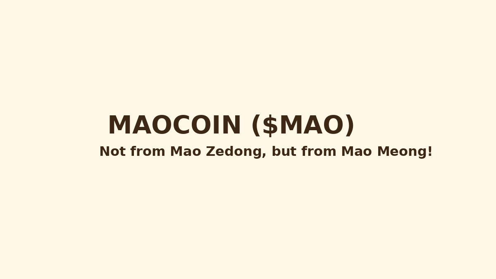

# 🐱 MAOCOIN ($MAO)

> Not from Mao Zedong, but from Mao Meong! 😼

MAOCOIN is the ultimate meme token powered by rebellion, cuteness, and a cat named Mao.  
Born from frustration, forged in decentralization, and delivered with a purr.

## 🔥 Features

- No roadmap. We walk randomly like real cats.
- 100% Meme-powered community.
- Anti-KYC. Anti-censorship. Pro-whiskers.

## 🌐 Website

Visit:https://slinger-ops.github.io/maocoin/

## 📸 Screenshots

## ✨ Anti-Roadmap

- ✨ Step 1: Do nothing (like a cat).
- 🌈 Step 2: Meme hard. Dump harder.
- ⚡ Step 3: Get banned in 3 countries.
- 🥳 Step 4: Party in the metaverse with fish-flavored chips.

## 🐾 Join Us

No utility. No promises.  
Just chaos, fun, and a fuzzy little revolution.

---

&copy; 2025 MAOCOIN. All laughs reserved.
